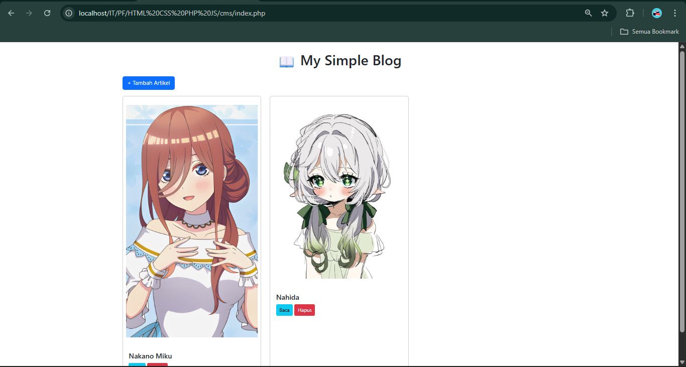

# 📰 Blog CMS (PHP + Bootstrap)

A simple **Content Management System (CMS)** for blogging, built with **PHP, MySQL, and Bootstrap**.  
This project is designed to manage articles with basic **CRUD functionality** (Create, Read, Delete).  
Perfect for beginners who want to learn **fullstack fundamentals**. ✨

---

## 🚀 Features
- 📄 List all blog posts on the homepage (`index.php`)
- 🔎 View single post detail (`post.php`)
- ➕ Add new posts with image upload (`admin.php`)
- 🗑️ Delete posts safely (`delete.php`)
- 🎨 Styled with **Bootstrap (CDN)** for a modern look

---

## 📂 Project Structure
```
blog-cms/
│── index.php → Homepage (list of posts)
│── post.php → Post detail page
│── admin.php → Add new post form
│── delete.php → Delete post by ID
│── db.php → Database connection
│── assets/
│ └── uploads/ → Folder for uploaded images

```
---

## 🛠️ Tech Stack
- **Frontend**: HTML5, Bootstrap 5 (via CDN)
- **Backend**: PHP (Procedural)
- **Database**: MySQL
- **Server**: XAMPP

---

## SQL
```
CREATE TABLE posts (
  id INT AUTO_INCREMENT PRIMARY KEY,
  title VARCHAR(255) NOT NULL,
  content TEXT NOT NULL,
  image VARCHAR(255) NOT NULL
);
```
---

📸 Screenshots


---
